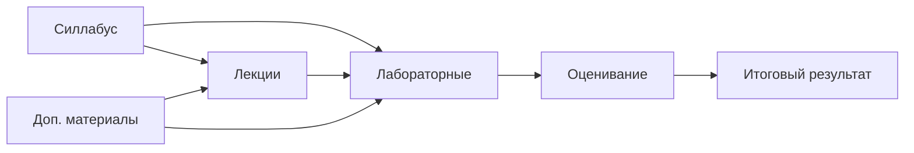

# Шаблон учебного репозитория в рамках программы ТОП-ИТ

> Универсальная структура репозитория для дисциплин в рамках программы ТОП-ИТ: силлабус, лекции, лабораторные, дополнительные материалы, оценивание и размещение решений студентами.

## Быстрая навигация

| Раздел                                | Назначение                                                    |
|---------------------------------------|---------------------------------------------------------------|
| [Силлабус](syllabus/README.md)        | цели, результаты обучения, политика курса, календарь          |
| [Лекции](lectures/README.md)          | конспекты, материалы до/после занятия                         |
| [Лабораторные](labs/README.md)        | задания, критерии, шаблоны отчета                             |
| [Доп. материалы](materials/README.md) | справочники, статьи, практики                                 |
| [Оценивание](assessment/README.md)    | рубрики, контрольные точки, итоговая схема                    |
| [Метаданные](meta/README.md)          | соглашения по структуре и Markdown                            |
| [Решения](solutions/README.md)        | исходный код и отчеты обучающихся в рамках лабораторных работ |

## Как использовать шаблон

1. Сделайте репозиторий из этого шаблона, нажав кнопку `Use this template` на платформе GitHub.
2. Заполните `syllabus/course.md`.
3. Для каждой темы скопируйте и заполните `lectures/00-template.md`.
4. Для каждой лабораторной скопируйте и заполните `labs/00-template.md`.
5. Обновите индексные `README.md`.
6. Выгрузите дополнительные материалы/книги/тесты.

## Рекомендуемая стратегия использования шаблона в рамках дисциплины

1. Сделайте репозиторий из этого шаблона и заполните его материалами в рамках дисциплины.
2. Каждый обучающийся на основе репозитория дисциплины создает свой собственный **публичный** репозиторий, через механизм ответвления (Fork). Для этого студентам необходимо нажать на соответствующую кнопку в группе кнопок справа от названия репозитория.
3. Обучающиеся **в своих отдельных репозиториях**, созданных через ответвление, выполняют лабораторные работы в директории `solutions`, куда также выгружают отчеты и дублируют их на почту преподавателю.

> [!TIP]
> На основе предложенного подхода преподаватель всегда может посмотреть что и когда разместил обучающийся!

## Карта курса

> [!TIP]
> Все содержательные элементы курса хранятся в Markdown, поэтому их удобно проверять через Git, обсуждать через Pull Request и автоматически публиковать как сайт документации.
